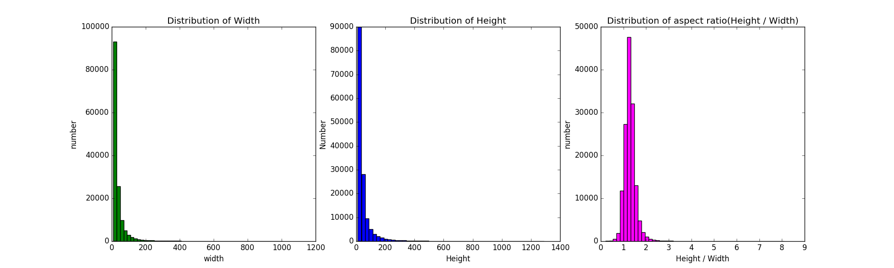
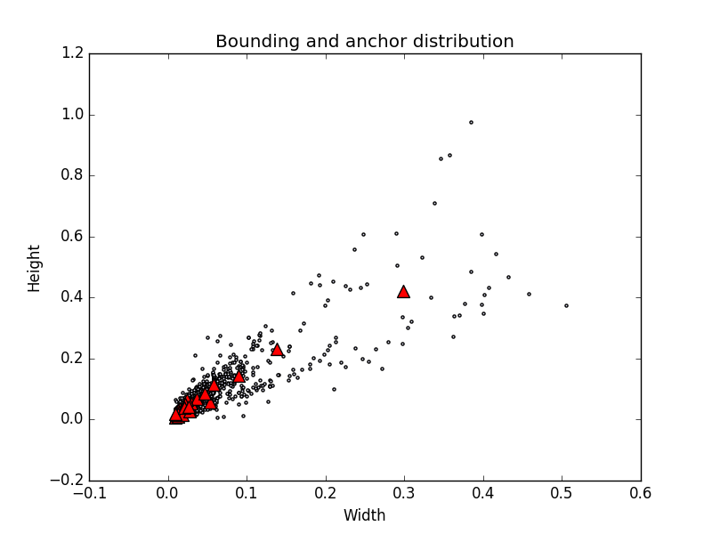

# object-detection-anchors
** Tips on how to find suitable object detection anchors **

When you are training an anchor based object detection model(SSD, YOLOv3, FasterRCNN et al), Find suitable anchors is vatal for good performance. 

For example, if you are detecting pole, the width:height ratio is nearly ** 1:10  ** or larger, if you set anchor aspect ratios to ** 1:3 **  and ** big scales ** , it is horrible.


The best method is to visualize your specific  objects width、height、and ratio. The famous YOLOv2 algorithm propose KMeans method to do bounding box cluster. We borrow code from [kmeans-anchor-boxes](https://github.com/lars76/kmeans-anchor-boxes), add some visualize function to show the result.

## Usage
prepare the annotation folder path in `example.py`, set the `cluster number`, and select wheter to normalize the bouding box.
`BBOX_NORMALIZE` means ` bounding box width and height` divided by the corresponding `image width and height`

We use Wider Face dataset as an example.
```
ANNOTATIONS_PATH = "./data/widerface-annotations"
CLUSTERS = 25
BBOX_NORMALIZE = False  

```
then run `python example.py`, the cluster result will show in the screen:


And the bounding boxes histogram.


25 sugested point will print on the terminal.
```
10.000      12.000     1.2
10.000      14.000     1.4
14.000      12.000     0.9
12.000      14.000     1.2
12.000      16.000     1.3
13.000      16.000     1.2
12.000      18.000     1.5
14.000      19.000     1.4
16.000      19.000     1.2
17.000      22.000     1.3
19.000      22.000     1.2
18.000      27.000     1.5
23.000      29.000     1.3
23.000      32.000     1.4
28.000      32.000     1.1
35.000      44.000     1.3
41.000      51.000     1.2
48.000      67.000     1.4
49.000      67.000     1.4
55.000      65.000     1.2
59.000      69.000     1.2
80.000      80.000     1.0
80.000      82.000     1.0
92.000      108.000     1.2
204.000      246.000     1.2
```
Now we can know from the chart and statistics, that the suitable aspect ratio is around 1.4， you can chose three aspect ratios, for example:1 、1.4、1.6.

### Normalize the bounding box

When we  set `normalized = True`, the cluster is:

The distribution is:

and the sugested anchor:
```
0.010      0.008     0.8
0.013      0.011     0.9
0.011      0.015     1.4
0.010      0.018     1.8
0.011      0.022     2.1
0.013      0.020     1.5
0.019      0.017     0.9
0.014      0.025     1.8
0.013      0.031     2.4
0.017      0.028     1.7
0.016      0.036     2.3
0.020      0.033     1.7
0.027      0.027     1.0
0.021      0.039     1.9
0.021      0.050     2.3
0.026      0.043     1.6
0.024      0.066     2.7
0.030      0.054     1.8
0.036      0.069     1.9
0.054      0.057     1.1
0.047      0.085     1.8
0.059      0.114     1.9
0.090      0.143     1.6
0.139      0.233     1.7
0.299      0.421     1.4
```

## Acknowledge
We borrowed nearly all of the codes from [kmeans-anchor-boxes](https://github.com/lars76/kmeans-anchor-boxes), greate thanks to [lars76](https://github.com/lars76/kmeans-anchor-boxes).
